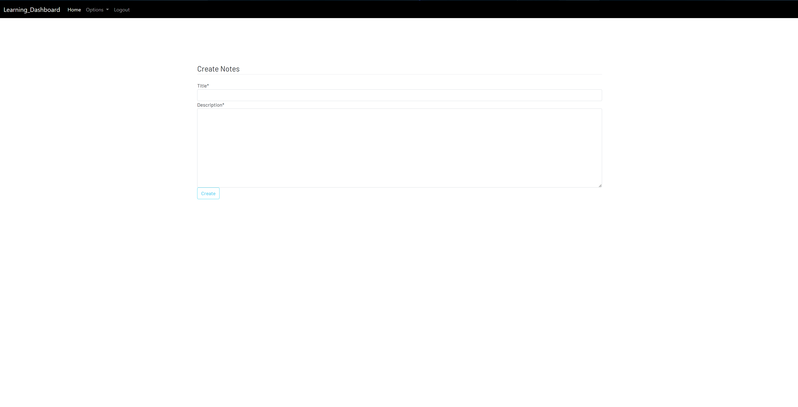
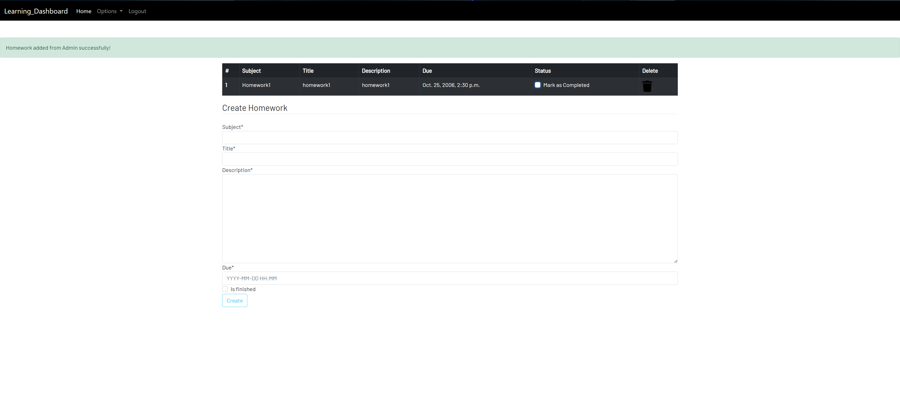

# Learning-dashboard
- Learning-dashboard is a site that hopes to demonstrate how pure HTML, CSS, JavaScript, Python and, Django  works in a real-world context. 
- The site will be targeted users who want to CRUD notes, CRUD homework, and search a book, and wikipedia.
- The site hopes to help users to make their learning easier.
- The users can register to us the notes, and homework.
- The users can us the books, and wikipedia with out register.
- It will show that the notes and the homeworks after the user is login.
- Learning-dashboard is a application will have a postgres database.

[Learning-dashboard](https://learning-dashboard.herokuapp.com/) site.

<b>Responsive</b>

 

# Navigator

- [**User experience UX**](<#user-experience-ux>)
    - [User stories](<#user-stories>)
    - [Site structure](<#site-structure>)
- [**Features**](<#features>)
    - [Existing features](<#existing-features>)
        - [Home](<#home>)
        - [Notes](<#notes>)
        - [Delete_note](<#delete_note>)
        - [Delete_note_confirm](<#delete_note_confirm>)
        - [Edit_note](<#edit_note>)
        - [Note_detail](<#note_detail>)
        - [Homework](<#homework>)
        - [Update_homework](<#update_homework>)
        - [Delete_homework](<#delete_homework>)
        - [Books](<#books>)
        - [Wiki](<#wiki>)
        - [Register](<#register>)
    - [Future features](<#future-features>)
        - [Delete_homework_confirm](<#delete_homework_confirm>)
        - [Edit_homework](<#edit_homework>)
        - [Homework_detail](<#homework_detail>)
        - [Add More Content](<#add-more-content>)
- [**Technologies used**](<#technologies-used>)
    - [Languages](<#languages>)
    - [Frameworks-Software](<#frameworks-software>)
    - [Libraries](<#libraries>)
    - [Python Packages](<#python-packages>)      
- [**Testing**](<#testing>)
    - [Code Validation](<#code-validation>)
    - [Browser Compatibility](<#browser-compatibility>)
    - [Responsiveness Test](<#responsiveness-test>)
    - [Lighthouse](<#lighthouse>)
    - [Manual testing](<#manual-testing>)
    - [User stories testing](<#user-stories-testing>)
    - [Fixed bugs](<#fixed-bugs>)
    - [Unfixed Bugs](<#unfixed-bugs>)
- [**Deployment**](<#deployment>)
    - [To deploy the project](<#to-deploy-the-project>)
    - [To fork the repository on GitHub](<#to-fork-the-repository-on-github>)
    - [To create a local clone of this project](<#to-create-a-local-clone-of-this-project>)
- [**Credits**](<#credits>)
    - [Content](<#content>)
    - [Media](<#media>)     
- [**Acknowledgements**](<#acknowledgements>)      

# User experience (UX)

## User stories

- As a user, I want to understand the purpose of this site upon loading it.
- As a user, I want to be able to know what are the instructions to use this site.
- As a user, I want to be able to add or delete note, and update the database.
- As a user, I want to be able to add or delete homework, and update the database.
- As a user, I want to be able to search a book, and open in a now tap.
- As a user, I want to be able to search on wikipedia, and open in a now tap.
- As a user, I want to be able to register, login and logout.
- As a user, I want to be able to navigate easily on the site.
- As a user, I want have an easy way of getting back to the home page.

[Back to top](<#navigator>)

## Site structure

- Learning-dashboard is an application that is presented on many pages website.
- When the application starts the user sees a short welcome message, and four choices.
- Two of them are accessed without login
- Two of them are accessed with login.
 
[Back to top](<#navigator>)

# Features 

## Existing features

### Home
- Render the home page.

[Back to top](<#navigator>)

### Notes
- Render the notes page, and the user abel to add note.
- The user gets a success message after he adds the note.

[Back to top](<#navigator>)

### Delete_note
- Redirect to the notes page, and the user abel to delete note.
- The user gets a success message after he deletes the note.

[Back to top](<#navigator>)

### Delete_note_confirm
- Redirect to the delete_note_confirm page, and the user abel to delete note or redirect to the notes page.

[Back to top](<#navigator>)

### Edit_note
- Redirect to the edit_note page, and the user abel to edit the note then redirect to the notes page.
- The user can in the edit_note page redirect to the notes page.

[Back to top](<#navigator>)

### Note_detail
- Redirect to the note_detail page, and the user is able to edit and delete the note.
- The user sees the full note.

[Back to top](<#navigator>)

### Homework
- Render the homework page, and the user abel to add homework.
- The user gets a success message after he adds the homework.

[Back to top](<#navigator>)

### Update_homework
- Render the homework page, and the user abel to update is_finished in homework.

[Back to top](<#navigator>)

### Delete_homework
- Redirect to the notes page, and the user abel to delete homework.
- The user gets a success message after he deletes the homework.

[Back to top](<#navigator>)

### Books
- Render the books page, get the input text from the user then search it, and get the top ten results.

[Back to top](<#navigator>)

### Wiki
- Render the wiki page, get the input text from the user then search it.

[Back to top](<#navigator>)

### Register
- Render the register page, get the input text from the user then create a user.
- The user gets a success message after he register.
- Redirect to the login page.

[Back to top](<#navigator>)

## Future features

### Delete_homework_confirm
- Redirect to the delete_homework_confirm page, and the user abel to delete homework or redirect to the notes page.

[Back to top](<#navigator>)

### Edit_homework
- Redirect to the edit_homework page, and the user is able to edit the note and then redirect to the homework page.
- The user can in the edit_homework page redirect to the homework page.

[Back to top](<#navigator>)

### Homework_detail
- Redirect to the homework_detail page, and the user abel to edit and delete the homework.
- The user sees the full homework.

### Add More Content
- Add More Content to book page.
- Add More Content to wiki page.

[Back to top](<#navigator>)

# Technologies used

[Back to top](<#navigator>)

## Languages

* [Python](https://en.wikipedia.org/wiki/Python_(programming_language)) - Provides the functionality for the site.
* [HTML5](https://en.wikipedia.org/wiki/HTML) - Provides the content and structure for the website.
* [CSS3](https://en.wikipedia.org/wiki/CSS) - Provides the styling for the website.
* [JavaScript](https://en.wikipedia.org/wiki/JavaScript) - Provides interactive elements of the website

[Back to top](<#navigator>)

## Frameworks-Software
* [Bootstrap](https://getbootstrap.com/) - A CSS framework that helps building solid, responsive, mobile-first sites
* [Django](https://www.djangoproject.com/) - A model-view-template framework used to create the Review | Alliance site
* [justinmind](https://www.justinmind.com/) - Used to create the wireframe.
* [Github](https://github.com/) - Used to host and edit the website.
* [Gitpod](https://www.gitpod.io) Used to create and edit the site, and used to push changes to the GitHub repository.
* [Heroku](https://en.wikipedia.org/wiki/Heroku) - A cloud platform that the application is deployed to.
* [Lighthouse](https://developer.chrome.com/docs/lighthouse/overview/) - Used to test performance of site.
* [Responsive Design Checker](https://www.responsivedesignchecker.com/) - Used for responsiveness check.
* [Google Chrome DevTools](https://developer.chrome.com/docs/devtools/) - Used to debug and test responsiveness.
* [Cloudinary](https://cloudinary.com/) - A service that hosts all static files in the project.
* [CSS Validation](https://jigsaw.w3.org/css-validator/) - Used to validate CSS code
* [PEP8 Validation](http://pep8online.com/) - At the time for deploying this project the PEP8 Online Validaton service was offline, therefore not used.

[Back to top](<#navigator>)

## Libraries

The libraries used in this project are located in the requirements.txt file and have been documented below

* [asgiref](https://pypi.org/project/asgiref/) - ASGI is a standard for Python asynchronous web apps and servers to communicate with each other, and positioned as an asynchronous successor to WSGI.
* [cloudinary](https://pypi.org/project/cloudinary/) - The Cloudinary Python SDK allows you to quickly and easily integrate your application with Cloudinary. Effortlessly optimize, transform, upload and manage your cloud's assets.
* [dj3-cloudinary-storage](https://pypi.org/project/dj3-cloudinary-storage/) - Django Cloudinary Storage is a Django package that facilitates integration with Cloudinary by implementing Django Storage API.
* [Django](https://pypi.org/project/Django/) - Django is a high-level Python web framework that encourages rapid development and clean, pragmatic design.
* [django-crispy-forms](https://pypi.org/project/django-crispy-forms/) - Used to integrate Django DRY forms in the project.
* [gunicorn](https://pypi.org/project/gunicorn/) - Gunicorn ‘Green Unicorn’ is a Python WSGI HTTP Server for UNIX. It’s a pre-fork worker model ported from Ruby’s Unicorn project. The Gunicorn server is broadly compatible with various web frameworks, simply implemented, light on server resource usage, and fairly speedy.
* [django-summernote](https://summernote.org/) 
* [psycopg2](https://pypi.org/project/psycopg2/) - Psycopg is the most popular PostgreSQL database adapter for the Python programming language.
* [pytz](https://pypi.org/project/pytz/) - This is a set of Python packages to support use of the OpenID decentralized identity system in your application, update to Python 3
* [sqlparse](https://pypi.org/project/sqlparse/) - sqlparse is a non-validating SQL parser for Python. It provides support for parsing, splitting and formatting SQL statements.

[Back to top](<#navigator>)

## Python Packages
- [Sys](https://docs.python.org/3/library/sys.html) - A module that provides access to used or maintained by the interpreter and to functions that interact strongly with the interpreter. It is always available (*text taken from [here](https://docs.python.org/3/library/sys.html)*)
- [OS](https://docs.python.org/3/library/os.html) - A module that provides a portable way of using OS dependent functionality.

[Back to top](<#navigator>)

# Testing 

## Code Validation

### Python

* No errors were returned when passing through the official [CI Python Linter](https://pep8ci.herokuapp.com/)
* admin.py - No errors or warnings reported
* forms.py - No errors or warnings reported
* models.py - No errors or warnings reported
* test.py - There were some E501(line too long) errors reported
* urls.py - There were some E501(line too long) errors reported
* views.py - There were some E501(line too long) errors reported

[Back to top](<#navigator>)

## Browser Compatibility

- Learning-dashboard site was tested on the following browsers Google Chrome, Safari and Mozilla Firefox.
- Appearance, functionality and responsiveness were consistent on a range of different device sizes and browsers.

[Back to top](<#navigator>)

## Responsiveness Test

* The responsive tests were exercised by using [Google Chrome DevTools](https://developer.chrome.com/docs/devtools/).

|        | iPad mine | Galaxy S5 | iPhone 6/7/8 | iPad | iPad Pro | iPhone 6/7/8 plus | Display >950px  |
|--------|-----------|-----------|--------------|------|----------|-------------------|-----------------|
| Text   | pass      | pass      | pass         | pass | pass     | pass              | pass            |
| images | pass      | pass      | pass         | pass | pass     | pass              | pass            |
| forms  | pass      | pass      | pass         | pass | pass     | pass              | pass            |

[Back to top](<#navigator>)

## Lighthouse
Learning-dashboard site was also tested using [Google Lighthouse](https://developers.google.com/web/tools/lighthouse) in Chrome Developer Tools to test the page for:
- Performance - How the page performs whilst loading.
- Accessibility - Is the site accessible for all users and how can it be improved.
- SEO - Search engine optimization. Is the site optimized for search engine result rankings.

<b>Lighthouse test</b>

 

[Back to top](<#navigator>)

## Manual testing
- Show home page working as expected.
- Home page features working as expected.
- Show notes page working as expected.
- Notes page features working as expected.
- Show homework page working as expected.
- Homework page features working as expected.
- Show books page working as expected.
- Books page features working as expected.
- Show wiki page working as expected.
- Wiki page features not working as expected.
- Show register page working as expected.
- Register page features working as expected. 
- If user is not login notes and homework pages redirect to the login page.
- After delete note redirect to the notes page.
- After edit note redirect to the notes page.
- After delete homework redirect to the homework page.
- The navigation bar working as expected. 

[Back to top](<#navigator>)

## Fixed bugs

- I faced during development, many of the yellow pages but it was mostly the wrong names or baths.
- The test did not work because of the database. so I add sys.
- I had to go back to the documents and lessons of Django during development to use it correctly.
- Fixing code linting errors.

[Back to top](<#navigator>)

### Unfixed Bugs

- Test the views required login it doesn't work.
- The wiki search does not work as expected.

[Back to top](<#navigator>)

# Deployment

## To deploy the project
The project was deployed to [Heroku](https://www.heroku.com). To deploy,I follow the process below:
  1. The first step is to log in to Heroku (or create an account if needed).
  2. In the top right corner there is a button that is labeled 'New'. Click that and then select 'Create new app'.
  3. Enter an application name that needs to be unique. When you have chose the name, choose your region and click 'Create app".
  4. On the next page, click the 'Settings' tab and find the "Config Vars" section. When you have found it, click "Reveal Config Vars". add values.
  5. Next step is to add buildpacks to the application which will run when the application is deployed. The reason why this is needed is because all dependencies and configurations will be installed for the application. To do this you scroll down to the buildpacks section on the settings page and click the button 'Add buildpack'.
  6. Add "Python" and node.js". It is important that Python is listed above node.js.
  7. Scroll to the top of the settings page and click the 'Deploy' tab. For deployment method, select 'Github'. Search for the repository name you want to deploy and then click connect.
  8. Scroll down on the deploy page and choose deployment type. Choose to enable automatic deployments if you want to and then click 'Deploy Branch'.

  [learning-dashboard](https://learning-dashboard.herokuapp.com/) site.

[Back to top](<#navigator>)

## To fork the repository on GitHub
A copy of the GitHub Repository can be made by forking the GitHub account. This copy can be viewed and changes can be made to the copy without affecting the original repository. Take the following steps to fork the repository;
1. Log in to **GitHub** and locate the [repository](https://github.com/ShahemNezamEddin/Learning-dashboard).
2. On the right-hand side of the page inline with the repository name, is a button called **'Fork'**. Click on the button to create a copy of the original repository in your GitHub Account.

[Back to top](<#navigator>)

## To create a local clone of this project
The method for cloning a project from GitHub is below:

1. Under the repository’s name, click on the **code** tab.
2. In the **Clone with HTTPS** section, click on the clipboard icon to copy the given URL.
3. In your IDE of choice, open **Git Bash**.
4. Change the current working directory to where you want the cloned directory to be made.
5. Type **git clone**, then paste the URL copied from GitHub.
6. Press **enter**, and the local clone will be created.

[Back to top](<#navigator>)
 
# Credits 

### Content 

- The idea came from Code Institute course materials and youtube videos.
- The inspiration for this project came from Hello Django and DjangoBlog projects.
- The font came from [Google Fonts](https://fonts.google.com/).
- The color palate was compiled by:
  - [Adobe color](https://color.adobe.com/).
  - [My color space](https://mycolor.space/).
  - [Contrast grid](https://contrast-grid.eightshapes.com/).
- [justinmind](https://www.justinmind.com/) - Used to create the wireframe.

[Back to top](<#navigator>)

### Media

- The photos used on the home page are from [Pexels](https://www.pexels.com/)

[Back to top](<#navigator>)

# Acknowledgements
I want to thank:
- My mentor [Precious Ijege](https://www.linkedin.com/in/precious-ijege-908a00168/) for guidance and support.
- Slack community and Code Institute crew for their help and support.
- My family and friends, for their user experience and feedback.

[Back to top](<#navigator>)
